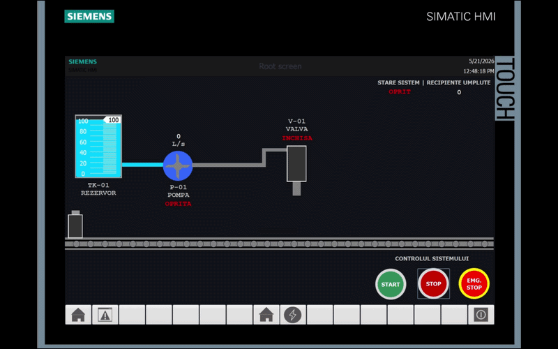
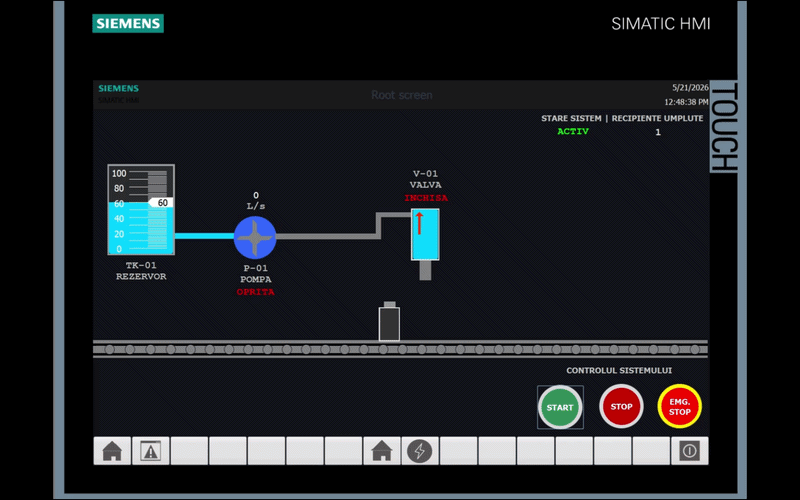

# Advanced Water Bottling Automation System (Digital Twin Simulation)

An enterprise-grade industrial automation and control project focusing on the design, mathematical modeling, and virtual implementation of an automated water bottling plant line. Developed as a high-fidelity **Digital Twin** inside Siemens TIA Portal V20 and WinCC, the system emulates a real-world industrial environment, combining precise physical process loops with Industry 4.0 predictive maintenance and production telemetry.

---

## 🖥️ Live HMI / SCADA Simulation

Here is the system running in real-time within the WinCC Runtime environment:

### 1. Process Control Interface
*Displays the sequential state-machine logic, conveyor movement, bottle positioning, and emergency control routines.*

### 2. Energy Management & Telemetry Dashboard
*Displays real-time KPI processing, including Specific Energy Consumption (SEC), carbon footprint calculations, and predictive maintenance wear counters.*

---

## 🏭 Plant Layout & Subsystem Architecture

The physical bottling plant is divided into three core, synchronized subsystems designed according to standard industrial instrumentation and piping practices:

1. **Storage & Supply System (TK-01):**
   * A large-scale water reservoir managed by a discrete logic-based hysteresis controller.
   * Automates the tank refilling loop, forcing high-low boundary constraints strictly between **20% (Low Limit)** and **95% (High Limit)** of the total volume capacity to prevent dry-running or overflow scenarios.
2. **Transfer & Dosing System (P-01 & V-01):**
   * Features a proportional hydraulic supply pump (P-01) that pipes raw material dynamically into a gravity-fed dosing valve assembly (V-01).
   * The valve utilizes discrete timing intervals to dispense a precise volume of fluid into each targeted container.
3. **Conveyor & Packaging Assembly:**
   * A motor-driven conveyor belt system orchestrated via a deterministic finite state machine (FSM).
   * Leverages simulated proximity sensors to align the physical axis of each bottle perfectly beneath the discharge nozzle of the dosing valve.

---

## 🚀 Key Automation Features

* **Hybrid Control Strategy:** Integrates sequential state-machine interlocks for safe material transport with continuous adaptive linear checks and hysteresis loops.
* **Defect Prevention & Anti-Cavitation Safety:** Hardware protection interlocks are embedded directly into the PLC code (e.g., automatically tripping pump P-01 if the TK-01 level drops below 5% to safeguard against pump cavitation).
* **State Retentivity & Safe Recovery:** In the event of an unpredicted power loss, software crash, or an Emergency Stop (EMG STOP) engagement, the system triggers a memory freeze. All current conveyor positions, batch metrics, and filling progress are saved in retentive non-volatile Data Blocks (DBs) to ensure zero raw material waste upon recovery.
* **Industry 4.0 Efficiency Metrics:** The logic natively tracks real-time Carbon Footprint (kg CO2 equivalents), automated lifetime operational runtime hours for predictive maintenance, and Specific Energy Consumption (SEC).

---

## 🛠️ Technology Stack & Industrial Specifications

* **Automation Suite:** Siemens TIA Portal V20 (Professional / Advanced)
* **HMI / SCADA Layer:** Siemens WinCC Unified / Advanced V20
* **Emulated PLC Hardware:** SIMATIC S7-1500 (CPU 1516-3 PN/DP)
* **Simulation Testing Engine:** Siemens S7-PLCSIM V20 / PLCSIM Advanced
* **Control Languages:** SCL (Structured Control Language / Structured Text)
* **Network Protocol:** PROFINET / Industrial Ethernet architecture

---

## 💻 Core Logic Implementation (SCL Architecture)

The control system executes deterministically within a cyclic interrupt block (`OB35`) clocked at a 100ms time-step interval to maintain true mathematical integration precision.

### 1. Power Consumption Diagnostics & Predictive Maintenance Wear
Tracks the physical runtime hours of the pump motor and integrates instantaneous electrical current data to compute energy draw (kWh):

    // Predictive Maintenance & Power Diagnostics
    IF "Date_Pompa".Motor.Pornit THEN
        // P = U * I * power_factor (simplified scale coefficient 0.22 for kW conversion)
        "Date_Pompa".Motor.Putere_kW := "Date_Pompa".Motor.Curent_A * 0.22;
        
        // Continuous energy integration over the deterministic execution time slice
        "Date_Pompa".Motor.Energie_kWh := "Date_Pompa".Motor.Energie_kWh + ("Date_Pompa".Motor.Putere_kW * 0.000002778);
        
        // Incremental lifecycle run-time logging (converted to hours)
        "Date_Pompa".Motor.TimpFunctionare_h := "Date_Pompa".Motor.TimpFunctionare_h + 0.000002778;
    END_IF;

### 2. Auto-Refill Reservoir Hysteresis & Financial SEC Tracking
Manages supply levels while including explicit math fault exceptions (division-by-zero protection) to guarantee that the PLC CPU never enters a `STOP` state during operation:

    // Automated Hysteresis Reservoir Loop (20% - 95%)
    IF "Date_Pompa".Nivel_Rezervor < 20.0 THEN
        "Date_Pompa".Alimentare_Activa := TRUE;
    ELSIF "Date_Pompa".Nivel_Rezervor > 95.0 THEN
        "Date_Pompa".Alimentare_Activa := FALSE;
    END_IF;

    // Financial Specific Energy Consumption (SEC) Telemetry Calculation
    IF "Date_Secventa".Productie.RecipiUmplute > 0 THEN
        "Date_Secventa".SEC := ("Date_Secventa".Energie_Totala * 1000.0) / INT_TO_REAL("Date_Secventa".Productie.RecipiUmplute);
    ELSE
        "Date_Secventa".SEC := 0.0; // Runtime Math Fault exception safeguard during startup initialization
    END_IF;

---

## ⚙️ Project Installation & Simulation Setup Guide

To run, review, or audit this Digital Twin project locally, follow these precise configuration steps:

### Prerequisites & Software Requirements
Ensure your engineering workstation has the following Siemens software packages installed:
* **Siemens TIA Portal V20** (Step 7 Professional)
* **WinCC V20** (Advanced or Unified depending on your specific layout target)
* **S7-PLCSIM V20** or **PLCSIM Advanced V20**

### Step 1: Cloning and Extracting the Project Assets
1. Clone this repository or download the source code files to your local hard drive.
2. Ensure that you do not alter the internal directory folder tree structure (`System`, `UserFiles`, `IM`), as this will corrupt the project references.

### Step 2: Launching the Project in TIA Portal V20
1. Launch **TIA Portal V20**.
2. Click on **Project** in the top menu bar, select **Open**, and browse to the directory where you extracted the project.
3. Select the central project file with the extension **`.ap20`** and click **Open**.
4. Switch over to the **Project View** (bottom-left corner) to view the project tree hierarchy, PLC blocks, and HMI screens.

### Step 3: Initializing the Virtual Controller Simulation (PLCSIM)
1. In the left-hand Project Tree, highlight the main PLC folder (e.g., `PLC_1 [CPU 1516-3 PN/DP]`).
2. Click on the **Start Simulation** icon located in the top toolbar (or select *Online -> Simulation -> Start*).
3. **S7-PLCSIM** will boot up automatically and generate a virtualized instance of the S7-1500 controller.
4. When the TIA Portal *Extended Load* dialogue window prompts you, set the PG/PC interface type to **PN/IE**, select **PLCSIM** as the interface, and click **Start Search**.
5. Select the discovered virtual controller instance and click **Load**. Confirm the configuration and make sure to select **Start Module** to place the PLC into virtual **RUN** mode.

### Step 4: Launching the WinCC HMI Operator Interface
1. In the left-hand Project Tree, navigate downwards and locate the HMI/SCADA folder (e.g., `HMI_1 [WinCC Comfort/Advanced]`).
2. Right-click on the HMI project folder and select **Compile** to ensure all graphic tags match up perfectly.
3. Click on the **Start Runtime** button in the top menu toolbar (the monitor icon with a green arrow).
4. The **WinCC Runtime Advanced/Unified** environment will spin up in a separate desktop window, establishing active loop communications with the running PLCSIM background task. You can now toggle the controls, trigger an `EMG STOP`, change tank variables, and review the live graphs.

---

## 🔒 License, Copyright & Confidentiality Terms

**Copyright © 2026 Ioan-Mădălin Munteanu. All rights reserved.**

This project is strictly **proprietary and confidential**. The source code, software architecture, DB schemes, SCL routines, and graphical HMI layout assets are published publicly on GitHub **SORELY for portfolio evaluation, academic auditing, and technical interview demonstration purposes** by prospective employers and technical recruiters.

**Under no circumstances is any user, corporation, or entity permitted to:**
1. Download, clone, copy, or duplicate this code for implementation inside real-world commercial production lines or industrial manufacturing plants.
2. Modify, transform, or build derivative industrial automation solutions based on the logic designs contained within this repository.
3. Redistribute, re-license, publish, or sell these engineering files to third parties.

*The engineering files are provided purely "as-is" for interview presentation metrics, without any structural warranties regarding real-world hardware deployment safety.*
